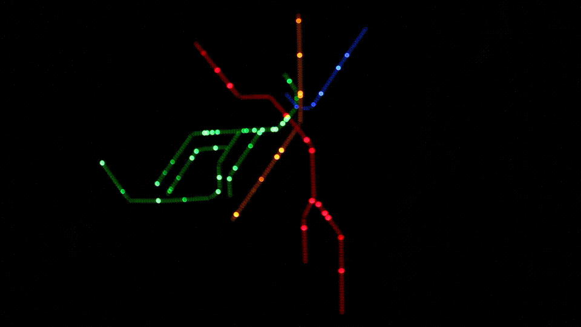
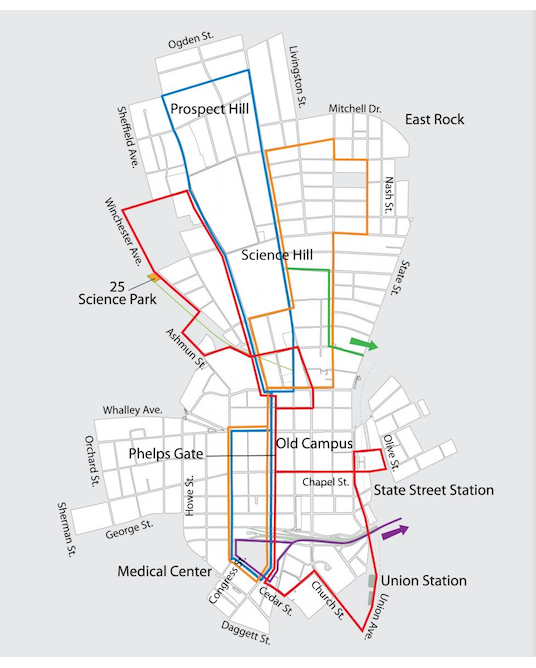
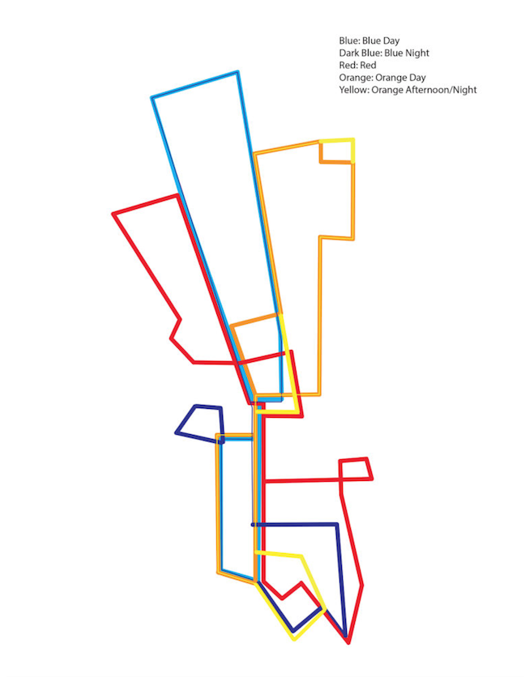
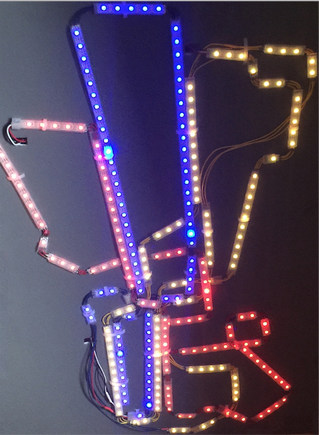

# Yale Shuttle Realtime LED Map

## Introduction 
This project is based off Ian Reynold's [LED project](https://medium.com/@idreyn/light-rail-93954dcc1e45) based
on the Massachusetts Bay Transportation Authority's train system in Boston.

This project aims to map the Yale Shuttle instead. 

## The Map
I based my map on this drawing of the Yale Shuttle which I found online.

After some revisions in Illustrator, I chose to map only the 
red, blue, and orange lines. 

## The Code 
The main challenge was to integrate realtime tracking for the shuttle. 
I used the Transloc API to track the shuttle.

## Final Product

